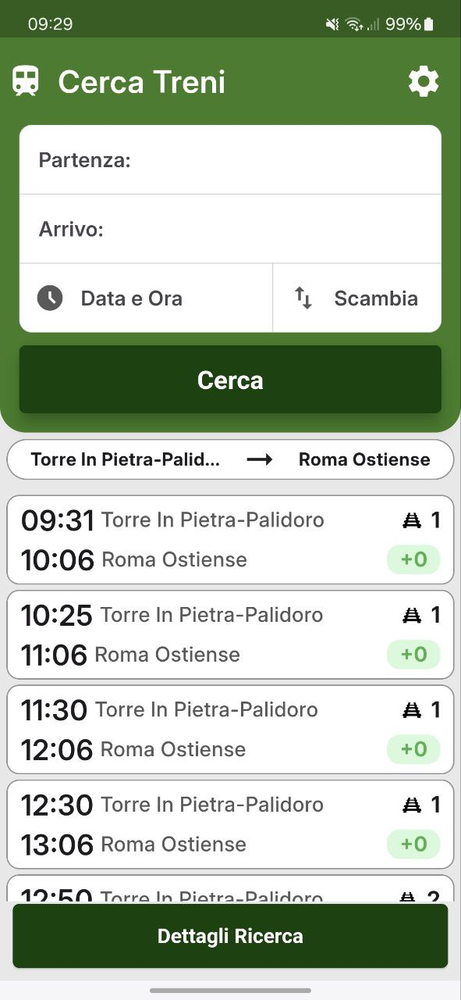
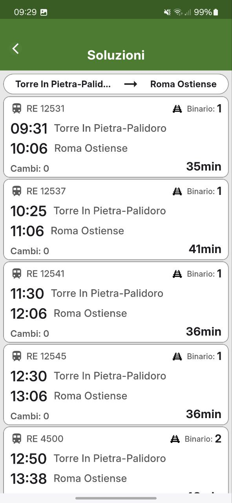
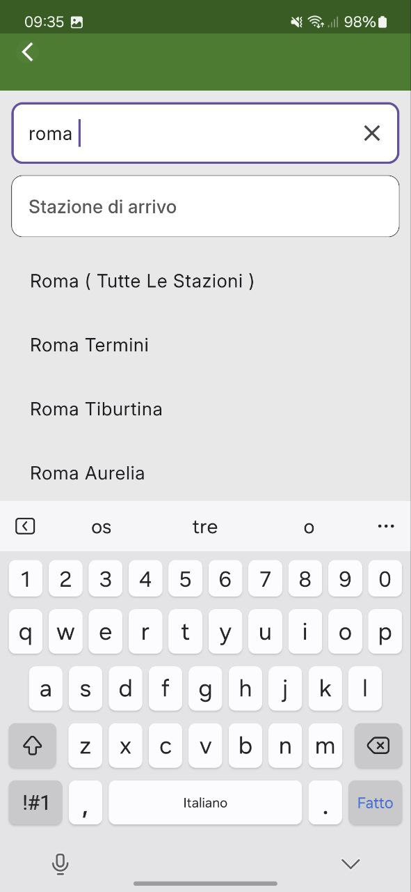

# Work in Progress

Questa vuole essere un'app per la ricerca di treni e la consultazione dei relativi status (ritardo, binario di partenza, capolinea, ecc.).  
Per ora, l'applicazione è quella mostrata negli screenshot qui sotto. Lo sviluppo è in corso.

---

### Home Page

---

### Dettaglio Soluzioni

---

### Ricerca con Autocomplete

---
