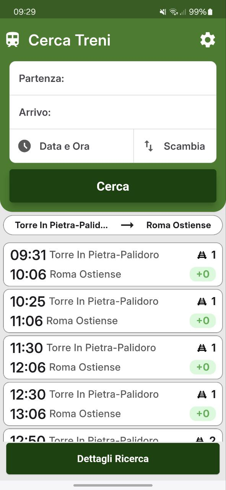
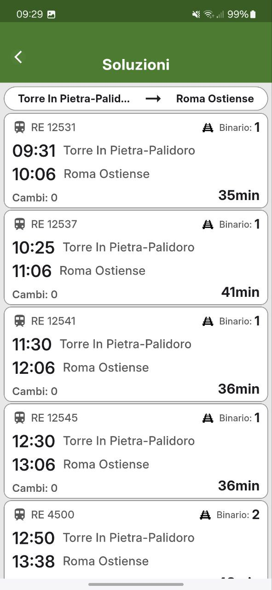
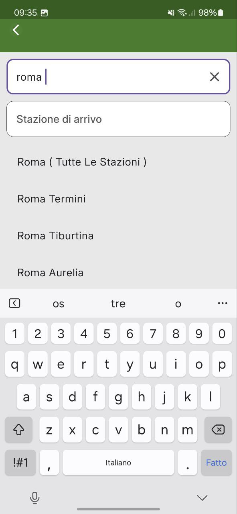

# Treni Pendolari

Questa è un'app pensata per i pendolari per la ricerca di treni e la consultazione dei relativi status, ritardi, binario di partenza, capolinea, ecc...  
Alla prima apertura verrà chiesto di inserire un viaggio di routine in modo tale da automatizzare la ricerca dei treni in base all'orario in cui solitamente viene preso.

---

### Home Page

---

### Dettaglio Soluzioni

---

### Ricerca con Autocomplete

---
